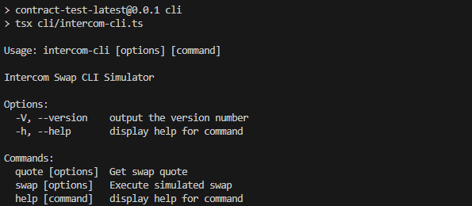
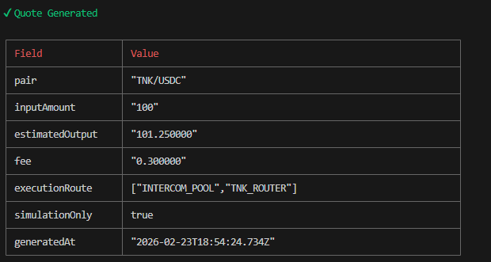
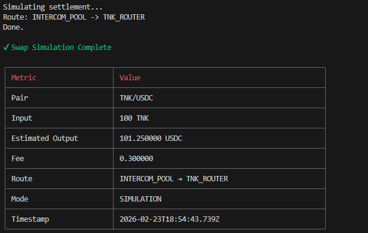

🚀 Intercom Swap CLI Simulator

A local simulation environment for testing quote and swap execution mechanisms without on-chain transactions.

This project was created as a simulation-first trading environment:

✅ Not making any real transactions

✅ No wallet needed

✅ Safe for testing & research

✅ Focus on pricing, fee, and execution flow simulation
---
📦 Features

CLI Swap Simulator

Quote Estimation Engine

Fee Calculation Modeling

Deterministic Pricing (Mock Liquidity)

REST API for Local Testing

Built with TypeScript + tsx

Zero Blockchain Interaction (Safe Sandbox)
---
📁 Project Structure
intercom-swap/
│
├── app/
│   └── server.ts          # Local API server
│
├── cli/
│   └── intercom-cli.ts    # CLI simulator
│
├── engine/
│   └── pricing.ts         # Quote & fee logic
│
├── package.json
├── tsconfig.json
└── README.md
---
⚙️ Installation

1️⃣ Clone Repository
git clone <https://github.com/bracklyhermes/intercom-swap>
cd intercom-swap
2️⃣ Install Dependencies
npm install
▶️ Run CLI Simulator
npm run cli

Output:

Usage: intercom-cli [options] [command]

Intercom Swap CLI Simulator
🔎 Get Quote (Simulation)
npm run cli -- quote --input TNK --output USDC --amount 100

Example Result:

Pair: TNK/USDC
Input: 100 TNK
Estimated Output: 101.25 USDC
Fee Applied: 0.3%
Route: INTERCOM_POOL → TNK_ROUTER
Status: Simulation Only

🔄 Simulate Swap Execution
npm run cli -- swap --input TNK --output USDC --amount 100

This will simulate:

Liquidity routing

Fee deduction

Execution preview

Final received amount

⚠️ No real swap occurs.
---
🌐 Run Local API (Optional)

Start server:

npm run assistant

Server runs at:

http://localhost:3000

Test endpoint:

POST /quote

Body:

{
  "input": "TNK",
  "output": "USDC",
  "amount": "100"
}
---
🧠 Simulation Model
Component	|Behavior
Pricing	  | Deterministic mock price
Fees	    | Fixed 0.3% LP simulation
Execution	| Dry-run only
Wallet	  | Not used
Blockchain| Not connected
Risk	None| (offline simulation)
---
📸 Proof of Execution

---
TRAC ADDRESS : trac123hnweuu24jkfrz6xav0jwk8hg2r58teeff6vhujxdkzkr9d84uq6nvv6p

🔐 Safety Notice

This project:

❌ Does not store private keys

❌ Does not sign transactions

❌ Does not connect to any network

✅ 100% local deterministic simulation
---
🛠️ Tech Stack

Node.js

TypeScript

tsx runtime

Commander CLI

Express (for local API)
---
🎯 Use Case

Suitbale for:

Trading agent prototyping

Quote engine testing

Risk modeling sandbox

Pre-integration validation

CLI workflow experimentation
---
✅ Status

WORKING — Local Simulation Environment Ready
---
📌 How to Run (Quick Start)
npm install
npm run cli -- quote --input TNK --output USDC --amount 100